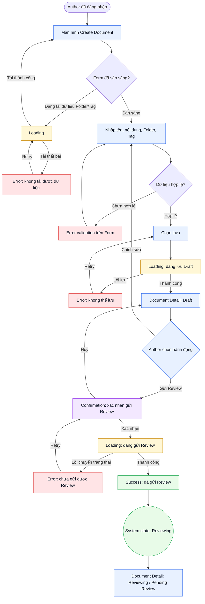
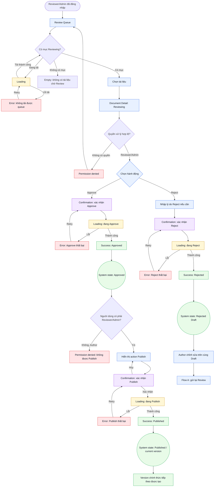
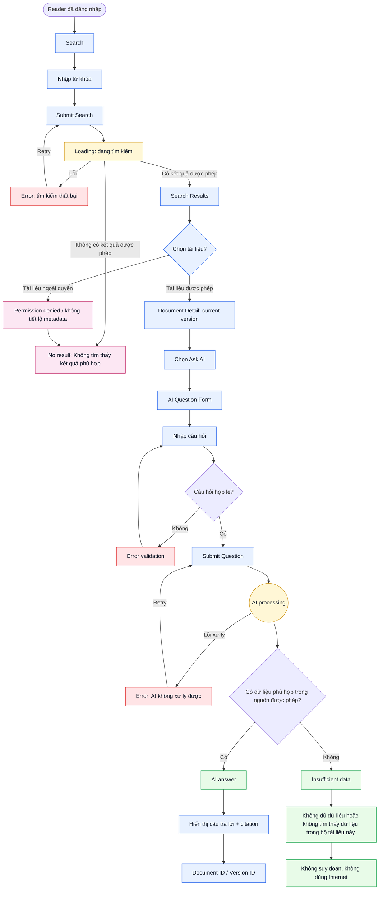

# Flow - AI Document & Knowledge Management System

## 1. Mô tả chung

Tài liệu mô tả sự di chuyển của người dùng qua các màn hình và sự thay đổi trạng thái hệ thống trong ba flow cốt lõi của MVP: Author tạo và gửi tài liệu vào Review; Reviewer/Admin Review và Publish; Reader Search và Ask AI. Các sơ đồ Mermaid thể hiện Happy Path, nhánh lỗi/ngoại lệ và những trạng thái giao diện cần được thiết kế, kiểm thử.

Các flow tuân thủ workflow: `Create -> Review -> Publish -> Version -> Search/Ask`. Author không được `Approve` hoặc `Publish`; chỉ Reviewer hoặc Admin được `Publish` bản Draft đã `Approved`. Search và Ask AI chỉ sử dụng tài liệu, metadata và version mà người dùng hiện tại có quyền truy cập.

## 2. FLOW A - Author tạo và gửi Review

**Mục tiêu:** Author tạo tài liệu `Quy trình nghỉ phép`, lưu ở trạng thái `Draft` và gửi đúng bản Draft vào Review.

### 2.1 Sơ đồ Mermaid

### 2.2 Bảng mô tả chi tiết

| Tên màn hình / Thành phần tương tác   | Thao tác của người dùng (Trigger)                               | Phản ứng của hệ thống & Trạng thái giao diện tương ứng (State)                                                                                                                         | Điều kiện chuyển hướng tiếp theo                                                                           |
| ------------------------------------- | --------------------------------------------------------------- | -------------------------------------------------------------------------------------------------------------------------------------------------------------------------------------- | ---------------------------------------------------------------------------------------------------------- |
| Create Document                       | Author mở màn hình tạo tài liệu.                                | Hiển thị Form ở trạng thái `Default`; tải Folder và Tag. Trong thời gian tải hiển thị `Loading`; lỗi tải hiển thị `Error` và `Retry`.                                                  | Khi dữ liệu phụ trợ tải thành công, cho phép nhập Form.                                                    |
| Create Document Form                  | Author nhập tên, nội dung, Folder `Nhân sự` và Tag `Nghỉ phép`. | Cập nhật dữ liệu cục bộ; kiểm tra required field và định dạng.                                                                                                                         | Nếu dữ liệu không hợp lệ, giữ người dùng ở Form và hiển thị lỗi validation; nếu hợp lệ, cho phép `Lưu`.    |
| Save Draft                            | Author chọn `Lưu`.                                              | Khóa thao tác gửi lặp và hiển thị `Loading`. Nếu lỗi, hiển thị `Error` và cho phép `Retry`. Nếu thành công, tạo tài liệu ở trạng thái `Draft`; bản Draft chưa phải version chính thức. | Chuyển đến Document Detail ở trạng thái `Draft`.                                                           |
| Document Detail - Draft               | Author chọn `Chỉnh sửa` hoặc `Gửi Review`.                      | Với `Chỉnh sửa`, mở lại Form. Với `Gửi Review`, mở `Confirmation`; chưa thay đổi trạng thái khi confirmation chưa được xác nhận.                                                       | `Hủy` quay lại Detail; `Xác nhận` bắt đầu chuyển trạng thái.                                               |
| Confirmation - Gửi Review             | Author xác nhận gửi bản Draft vào Review.                       | Hiển thị `Loading`; hệ thống kiểm tra bản Draft còn hợp lệ và thuộc quyền Author.                                                                                                      | Lỗi thì hiển thị `Error` và cho phép thử lại; thành công thì chuyển trạng thái nghiệp vụ sang `Reviewing`. |
| Success / Document Detail - Reviewing | Hệ thống hoàn tất gửi Review.                                   | Hiển thị `Success`; Document Detail hiển thị `Reviewing` hoặc nhãn giao diện `Pending Review`. Gắn đúng tài liệu, bản Draft và người gửi.                                              | Tài liệu xuất hiện trong Review queue của Reviewer/Admin; Author không có action `Approve` hoặc `Publish`. |

## 3. FLOW B - Reviewer/Admin Review và Publish

**Mục tiêu:** Reviewer hoặc Admin kiểm tra bản Draft, thực hiện `Approve` hoặc `Reject`, sau đó `Publish` bản đã `Approved` để tạo version chính thức và đánh dấu version hiện hành.

### 3.1 Sơ đồ Mermaid

### 3.2 Bảng mô tả chi tiết

| Tên màn hình / Thành phần tương tác | Thao tác của người dùng (Trigger)                       | Phản ứng của hệ thống & Trạng thái giao diện tương ứng (State)                                                                                                               | Điều kiện chuyển hướng tiếp theo                                                                                                                 |
| ----------------------------------- | ------------------------------------------------------- | ---------------------------------------------------------------------------------------------------------------------------------------------------------------------------- | ------------------------------------------------------------------------------------------------------------------------------------------------ |
| Review Queue                        | Reviewer/Admin mở Review queue.                         | Hiển thị `Loading` khi tải. Nếu lỗi, hiển thị `Error` và `Retry`. Nếu không có mục Reviewing, hiển thị `Empty`.                                                              | Khi có dữ liệu, hiển thị các tài liệu ở trạng thái `Reviewing` và cho phép chọn.                                                                 |
| Review Queue Item                   | Reviewer/Admin chọn tài liệu.                           | Mở Detail với document, version, Author, Folder, Tag và trạng thái.                                                                                                          | Nếu role không hợp lệ, hiển thị `Permission denied` và không cho thao tác; nếu hợp lệ, cho phép `Approve` hoặc `Reject`.                         |
| Document Detail - Reviewing         | Người xử lý kiểm tra nội dung và metadata.              | Hiển thị đúng bản Draft đang được Review; lưu context tài liệu và version đang xử lý.                                                                                        | Chọn `Approve` để mở confirmation Approve hoặc `Reject` để nhập lý do nếu prototype yêu cầu.                                                     |
| Confirmation - Approve              | Reviewer/Admin xác nhận `Approve`.                      | Hiển thị `Loading`; lưu người xử lý, thời điểm và kết quả Review.                                                                                                            | Lỗi thì hiển thị `Error` và cho phép retry; thành công chuyển bản Draft sang trạng thái nghiệp vụ `Approved`, nhưng chưa tạo version chính thức. |
| Approved Detail                     | Reviewer/Admin chọn `Publish`.                          | Chỉ Reviewer/Admin thấy action `Publish`; bản chưa `Approved` hoặc đã `Rejected` bị chặn. Nếu Author cố Publish, hiển thị `Permission denied`.                               | Chọn `Publish` mở confirmation; hủy confirmation giữ nguyên `Approved`.                                                                          |
| Confirmation - Publish              | Reviewer/Admin xác nhận `Publish`.                      | Hiển thị `Loading`; kiểm tra bản đã `Approved` và người dùng có quyền.                                                                                                       | Lỗi hiển thị `Error`; thành công hiển thị `Success` và chuyển sang `Published`.                                                                  |
| Published / Version                 | Hệ thống hoàn tất Publish.                              | Tạo version chính thức tiếp theo, đánh dấu là version hiện hành và hiển thị trạng thái `Published`; version chính thức cũ không còn hiện hành nhưng được giữ theo retention. | Version hiện hành được dùng cho Search/Q&A. Tác vụ retention chạy hằng ngày lúc 02:00 và không xóa version hiện hành.                            |
| Confirmation - Reject               | Reviewer/Admin nhập lý do nếu cần và xác nhận `Reject`. | Hiển thị `Loading`; lưu người xử lý, thời điểm, kết quả và lý do nếu có.                                                                                                     | Lỗi hiển thị `Error`; thành công chuyển sang `Rejected`.                                                                                         |
| Rejected Draft                      | Author mở lại bản Draft bị Reject.                      | Hiển thị `Success` trước đó và trạng thái `Rejected`; bản Draft được giữ nguyên, không tạo version chính thức.                                                               | Author chỉnh sửa trên cùng Draft và quay lại Flow A để gửi Review lại.                                                                           |

## 4. FLOW C - Reader Search và Ask AI

**Mục tiêu:** Reader tìm và đọc tài liệu được phép, sau đó hỏi AI bằng dữ liệu nội bộ được phép và kiểm tra nguồn qua `citation`.

### 4.1 Sơ đồ Mermaid

### 4.2 Bảng mô tả chi tiết

| Tên màn hình / Thành phần tương tác | Thao tác của người dùng (Trigger)                                         | Phản ứng của hệ thống & Trạng thái giao diện tương ứng (State)                                                                                 | Điều kiện chuyển hướng tiếp theo                                                                                                            |
| ----------------------------------- | ------------------------------------------------------------------------- | ---------------------------------------------------------------------------------------------------------------------------------------------- | ------------------------------------------------------------------------------------------------------------------------------------------- |
| Search                              | Reader nhập từ khóa và submit.                                            | Hiển thị `Loading`; Search áp dụng permission-aware retrieval, chỉ truy vấn tài liệu Reader được phép xem.                                     | Lỗi hiển thị `Error` và `Retry`; có kết quả chuyển đến Search Results; không có kết quả được phép chuyển đến `No result`.                   |
| Search Results                      | Reader xem hoặc chọn một kết quả.                                         | Chỉ hiển thị document và metadata trong quyền hiện tại. Tài liệu `Quy định lương thưởng` không được xuất hiện với Reader A nếu không có quyền. | Nếu tài liệu được phép, mở Document Detail; nếu có truy cập trực tiếp ngoài quyền, chặn bằng `Permission denied` và không tiết lộ metadata. |
| No result                           | Reader xem kết quả rỗng.                                                  | Hiển thị `Không tìm thấy kết quả phù hợp` hoặc thông báo tương đương, không xác nhận sự tồn tại của tài liệu bị hạn chế.                       | Reader có thể sửa query và Search lại.                                                                                                      |
| Document Detail - current version   | Reader mở tài liệu được phép và chọn `Ask AI`.                            | Hiển thị nội dung và version hiện hành; không cho Reader dùng version bị thay thế làm nguồn Q&A.                                               | Mở AI Question Form.                                                                                                                        |
| AI Question Form                    | Reader nhập câu hỏi `Nhân viên được nghỉ phép bao nhiêu ngày?` và submit. | Kiểm tra câu hỏi; lỗi validation giữ Reader ở Form và hiển thị `Error`.                                                                        | Câu hỏi hợp lệ chuyển sang `AI processing`.                                                                                                 |
| AI processing                       | Hệ thống nhận câu hỏi.                                                    | Hiển thị trạng thái `AI processing`; chỉ truy xuất tài liệu nội bộ, được phép và version hiện hành.                                            | Lỗi xử lý hiển thị `Error` và cho phép retry; có dữ liệu chuyển sang AI answer; không có dữ liệu chuyển sang `Insufficient data`.           |
| AI answer                           | Hệ thống tạo câu trả lời.                                                 | Hiển thị câu trả lời cùng `document ID/version ID` hoặc `citation` tương đương; citation phải truy lại được nguồn mà Reader có quyền xem.      | Reader có thể mở citation để kiểm tra Document Detail; không hiển thị citation ngoài quyền.                                                 |
| Insufficient data                   | Hệ thống không tìm thấy nguồn phù hợp trong tập được phép.                | Hiển thị chính xác: `Không đủ dữ liệu hoặc không tìm thấy dữ liệu trong bộ tài liệu này.` Không suy đoán và không dùng nguồn Internet.         | Kết thúc lượt hỏi hoặc cho phép Reader sửa câu hỏi và thử lại.                                                                              |

## 5. Quy tắc chuyển trạng thái dùng chung

- `Draft` là bản đang soạn và chưa phải version chính thức. `Lưu` không tạo version chính thức.
- `Reviewing` là trạng thái nghiệp vụ của bản đã được gửi Review; UI có thể dùng nhãn `Pending Review` nhưng phải giữ cùng ý nghĩa.
- `Approve` chỉ chấp nhận bản Draft; `Approve` không tạo version chính thức.
- Chỉ Reviewer hoặc Admin được `Publish` bản đã `Approved`. `Publish` tạo version chính thức tiếp theo và đánh dấu version đó là version hiện hành.
- `Reject` giữ bản Draft để Author chỉnh sửa và gửi lại trên cùng bản; `Reject` không tạo version chính thức.
- Search, nội dung tài liệu, metadata, citation và Q&A đều phải tuân thủ quyền truy cập hiện tại của Reader.
- Version không hiện hành được giữ theo chính sách retention; tác vụ chạy hằng ngày lúc 02:00 và không xóa version hiện hành.
