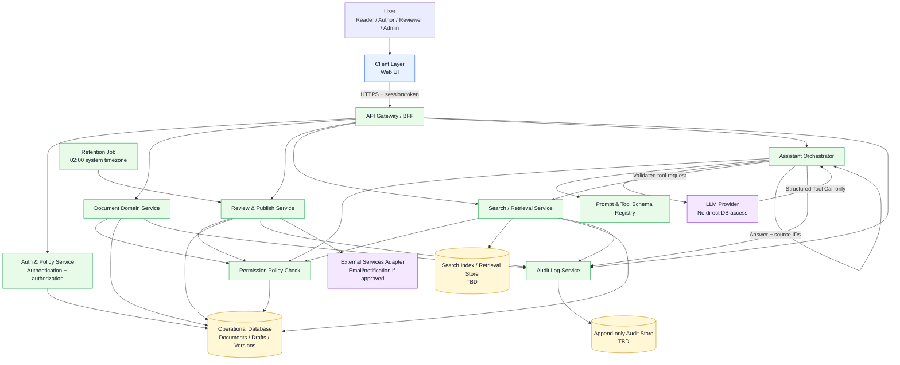
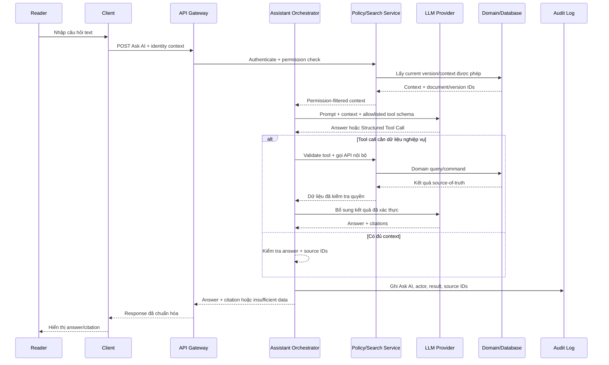

# ARCHITECTURE - AI Document & Knowledge Management System

## 1. Phạm vi và nguyên tắc kiến trúc

Tài liệu mô tả kiến trúc MVP cho AI Document & Knowledge Management System (AI KMS), tập trung vào các luồng `Create -> Review -> Publish -> Version -> Search/Ask` và bốn role `Reader`, `Author`, `Reviewer`, `Admin`.

Stack triển khai cụ thể hiện chưa được chốt trong ADR-001; vì vậy các thành phần framework/ngôn ngữ được ghi là `TBD` và không được xem là quyết định công nghệ. Kiến trúc logic dưới đây là contract cần giữ dù stack thay đổi.

Các nguyên tắc bắt buộc:

- LLM/AI không truy cập trực tiếp Database. LLM chỉ được yêu cầu đề xuất Structured Tool Calls; Backend xác thực, thực thi và kiểm soát kết quả.
- Domain Services và Database là source-of-truth cho quyền truy cập, trạng thái tài liệu, version hiện hành và audit record. AI không được tự quyết định hoặc tự bịa dữ liệu nghiệp vụ.
- Permission-aware retrieval phải được áp dụng trước khi Search hoặc Q&A nhận dữ liệu nguồn.
- Các hành động quan trọng gồm tối thiểu `Create`, `Edit`, `Review`, `Approve`, `Publish` và `Ask AI`; mỗi record phải có tài khoản, hành động, đối tượng, thời điểm và kết quả.
- LLM Provider không được dùng nguồn Internet cho Q&A MVP; nguồn trả lời phải là tài liệu nội bộ được phép và version hiện hành.

## 2. Sơ đồ kiến trúc

### Ranh giới bảo mật trong sơ đồ

- `LLM Provider` chỉ nhận prompt/context đã được lọc quyền và schema tool; không nhận credential Database và không mở network route tới Database.
- `Assistant Orchestrator` là lớp duy nhất giao tiếp với LLM. Orchestrator không tự đọc Database; muốn lấy dữ liệu phải gọi Domain/Search Service qua API nội bộ.
- `Policy Check` phải chạy ở Backend, không tin vào role hoặc document ID do Client gửi lên.
- `Audit Log Service` nhận sự kiện từ các command quan trọng; audit record phải được ghi với kết quả thành công hoặc thất bại.

## 3. Chi tiết các phân lớp

### 3.1 Client Layer - Frontend

**Nhiệm vụ:**

- Hiển thị UI cho Create Document, Document Detail, Review Queue, Search Results, Ask AI và Version History.
- Gửi command/query qua API Gateway; không chứa business rule quyết định quyền, trạng thái Publish hoặc version hiện hành.
- Hiển thị các state `Loading`, `Empty`, `Error`, `Confirmation`, `Success`, `Permission denied` và `AI processing`.
- Hiển thị citation gồm document ID/version ID do Backend trả về; không tự tạo citation.
- Không lưu secret của LLM, Database hoặc service-to-service credential trong browser.

**Công nghệ:**

- Framework web: `TBD` trong ADR-001.
- Giao tiếp: HTTPS, JSON API hoặc contract tương đương do `api-contract.md` chốt.
- State/query cache: `TBD`; cache không được làm lộ dữ liệu giữa các user hoặc role.
- Accessibility: keyboard navigation, focus management, ARIA state cho loading/error/dialog.

### 3.2 Application Layer - Backend & API

#### API Gateway / BFF

- Tiếp nhận HTTPS request, correlation ID, rate limit và chuẩn hóa error response.
- Xác thực session/token qua Auth Service trước khi gọi application service.
- Không tự quyết định permission; chuyển identity và request context tới Policy/Domain Service.
- Không expose LLM Provider, Database hoặc Audit Store trực tiếp cho Client.

#### Auth & Policy Service

- Xác thực danh tính và gắn role tối thiểu: `Reader`, `Author`, `Reviewer`, `Admin`.
- Kiểm tra quyền trên từng tài nguyên và hành động: xem, tạo, sửa, Review, Approve, Publish, Search, Q&A.
- Mô hình RBAC/ABAC cụ thể vẫn `TBD`; không được tự suy đoán mô hình khi chưa có phê duyệt.
- Khi từ chối, trả lỗi permission nhất quán và không làm lộ metadata tài liệu ngoài quyền.

#### Domain Services

| Service                      | Trách nhiệm chính                                             | Invariant cần bảo vệ                                                                                                             |
| ---------------------------- | ------------------------------------------------------------- | -------------------------------------------------------------------------------------------------------------------------------- |
| Document Domain Service      | Tạo/sửa Draft, Folder, Tag, đọc nội dung được phép.           | Draft chưa Publish không phải version chính thức; Reader không được sửa.                                                         |
| Review & Publish Service     | Review queue, Approve, Reject, Publish và version transition. | Chỉ Reviewer/Admin được Approve/Publish theo quyền; chỉ bản Approved mới được Publish; Publish tạo duy nhất một current version. |
| Search / Retrieval Service   | Search và lấy context cho Q&A theo quyền.                     | Không trả tài liệu ngoài quyền; chỉ dùng version hiện hành cho Search/Q&A.                                                       |
| Version/Retention capability | Tạo version chính thức sau Publish và retention job.          | Version cũ không hiện hành không làm source hiện tại; retention 02:00 không xóa current version.                                 |

#### Assistant Orchestrator

1. Nhận câu hỏi text của Reader và identity context từ Backend.
2. Gọi Policy/Search Service để lấy tập context được phép; không query Database trực tiếp.
3. Gửi LLM prompt gồm câu hỏi, context đã lọc và tool schema; cấm nguồn Internet.
4. Parse và validate output/Structured Tool Call theo schema allowlist.
5. Nếu tool call cần dữ liệu nghiệp vụ, Backend thực thi qua Search/Domain Service rồi trả kết quả đã kiểm tra cho LLM.
6. Trả answer cùng document ID/version ID hoặc citation tương đương; nếu không đủ nguồn, trả thông báo `Không đủ dữ liệu hoặc không tìm thấy dữ liệu trong bộ tài liệu này.`
7. Ghi audit `Ask AI` cùng actor, câu hỏi/request ID, source IDs, kết quả và thời điểm; không ghi secret hoặc dữ liệu nhạy cảm không cần thiết.

LLM output là untrusted input: không thực thi arbitrary SQL, arbitrary URL, tool name ngoài allowlist hoặc instruction yêu cầu bỏ qua permission.

#### Audit Log Service

- Nhận event từ API Gateway hoặc application services sau mỗi command quan trọng.
- Record tối thiểu: `actor_id`, `action`, `object_type`, `object_id`, `occurred_at`, `result`, `correlation_id` và metadata audit cần thiết.
- Ưu tiên append-only; quyền sửa/xóa audit phải bị giới hạn và được ghi nhận tiếp.
- Audit failure policy cần được chốt: với command quan trọng, transaction có thể cần fail nếu không ghi được audit; đây là điểm cần quyết định trước implementation.

### 3.3 Data & External Layer

#### Operational Database

Database lưu dữ liệu nghiệp vụ chuẩn: User/role, Document, Draft, Folder, Tag, Review Request, official Version, current-version marker và source record Q&A. Công nghệ và schema vật lý `TBD` trong ADR-002/database-schema.

Các yêu cầu consistency:

- Transition trạng thái phải là command có kiểm tra state hiện tại, không phải update tùy ý từ Client.
- Publish và đánh dấu current version phải atomic; một tài liệu không được có hai current version.
- Review, Approve, Reject và Publish phải lưu actor/time/result phục vụ audit.
- Query trả về cho Search/Q&A phải được filter theo permission trước khi đưa vào index/context.

#### Search Index / Retrieval Store

- Có thể dùng index riêng để tối ưu Search, nhưng index không phải source-of-truth cho quyền hoặc trạng thái version.
- Mỗi record index cần document ID, version ID, trạng thái current và metadata filter được phép.
- Khi quyền hoặc current version thay đổi, phải re-index/invalidate phù hợp; trong mọi trường hợp Backend vẫn re-check permission trước khi trả kết quả.

#### LLM Provider

- Kết nối qua adapter để thay Provider mà không ảnh hưởng Domain Services.
- Chỉ gửi context tối thiểu, đã permission-filter; không gửi toàn bộ Database.
- Timeout, retry có giới hạn, model/version và request ID phải được log ở mức audit/operational phù hợp.
- Provider không được truy cập Internet hoặc nguồn ngoài kho nội bộ trong Q&A MVP.

#### External Services Adapter

Email/notification chỉ là capability tùy chọn nếu được scope chốt. Mọi external call phải đi qua adapter, timeout/circuit breaker phù hợp và không làm thay đổi source-of-truth nếu provider bên ngoài phản hồi không chắc chắn.

## 4. Luồng đi của dữ liệu

### 4.1 Luồng Create -> Review -> Publish -> Version

1. Author thao tác trên Client và gửi command tới API Gateway.
2. Gateway xác thực identity; Policy Service kiểm tra quyền Author và tài liệu/command.
3. Document Domain Service validate Name, Content, Folder, Tag và lưu `Draft` vào Database.
4. Khi Author `Gửi Review`, Review Service kiểm tra Draft chưa có request đang xử lý, tạo Review Request liên kết Document + Draft + sender và chuyển trạng thái sang `Reviewing`.
5. Reviewer/Admin chọn `Approve` hoặc `Reject`; Review Service kiểm tra role/state, lưu actor/time/result và audit event.
6. Với `Reject`, cùng Draft được giữ để Author sửa và gửi lại; không tạo official version.
7. Với `Approve`, bản chỉ được chấp nhận, chưa phải official version. Reviewer/Admin phải gọi `Publish`.
8. Publish được thực thi trong transaction: tạo official version tiếp theo, đánh dấu version mới là current, đánh dấu version cũ không current và chuyển document sang `Published`.
9. Response trả về UI và Audit Log ghi command/result; version current mới là nguồn cho Search/Q&A.

### 4.2 Luồng Search

1. Reader nhập query và gửi `Search` qua API Gateway.
2. Auth/Policy xác thực Reader; Search Service lọc theo quyền hiện tại trước khi truy vấn index/database.
3. Search Service chỉ trả các document/version được phép và current; item ngoài quyền không được đưa vào response.
4. Client hiển thị results hoặc `Không tìm thấy kết quả phù hợp`; không suy ra sự tồn tại của tài liệu bị hạn chế.
5. Search request và kết quả audit cần thiết được ghi theo policy audit đã chốt.

### 4.3 Luồng Ask AI với Structured Tool Calls

Nếu không có dữ liệu phù hợp, Orchestrator không yêu cầu LLM đoán; Backend trả `Không đủ dữ liệu hoặc không tìm thấy dữ liệu trong bộ tài liệu này.` Nếu LLM trả tool call không hợp lệ, Backend từ chối tool call và ghi failure.

## 5. API và giao tiếp nội bộ

Các endpoint cụ thể chưa được chốt trong `api-contract.md`; nhóm cần giữ các nhóm command/query tối thiểu sau:

| Nhóm API        | Ví dụ logical operation                      | Kiểm tra bắt buộc                                                          |
| --------------- | -------------------------------------------- | -------------------------------------------------------------------------- |
| Documents       | Create Draft, Edit Draft, Get Document       | Role, ownership/permission, input validation, current state.               |
| Review          | Send Review, Review Queue, Approve, Reject   | Reviewer/Admin role cho Review actions; không duplicate request; audit.    |
| Publish/Version | Publish Approved Draft, Get Version History  | Approved state, Reviewer/Admin role, atomic current-version transition.    |
| Search          | Search permitted documents                   | Permission-aware retrieval trước response; không lộ metadata ngoài quyền.  |
| Ask AI          | Submit question, return answer/source record | Reader access, internal sources only, structured output validation, audit. |
| Audit           | Query audit history theo quyền               | Không cho sửa record tùy ý; filter actor/object visibility theo policy.    |

Error contract nên phân biệt tối thiểu `400` validation, `401` unauthenticated, `403` permission denied, `404` resource không được phép hiển thị như tồn tại, `409` invalid state/concurrency và `5xx` dependency/system failure. Mã cuối cùng cần được chốt trong `api-contract.md`.

## 6. Rủi ro kỹ thuật và phòng ngừa

| Rủi ro                                  | Tác động                                                                   | Phòng ngừa / kiểm chứng                                                                                                                                                                                                             |
| --------------------------------------- | -------------------------------------------------------------------------- | ----------------------------------------------------------------------------------------------------------------------------------------------------------------------------------------------------------------------------------- |
| Latency hoặc timeout từ LLM Provider    | Reader chờ lâu, request trùng hoặc UI hiển thị câu trả lời thiếu citation. | Timeout theo request, retry có giới hạn với backoff, trạng thái `AI processing`, chống submit lặp, fallback `Insufficient data`/error rõ ràng; đo p95 latency và test dependency failure.                                           |
| Mất kết nối hoặc lỗi nhất quán Database | Mất Draft, sai trạng thái Review/Publish hoặc có hơn một current version.  | Transaction cho state transition và Publish, unique constraint cho current version, retry an toàn/idempotency key, connection pool/health check, backup/restore test; không báo success khi chưa commit và chưa xử lý audit policy. |

Các rủi ro cần theo dõi thêm khi triển khai: LLM trả tool call độc hại/sai schema, index lệch quyền sau thay đổi access, audit store unavailable và lộ dữ liệu nhạy cảm trong prompt/log. Đây là các điểm phải có test bảo mật trước nghiệm thu MVP.

## 7. Verification checklist

- [ ] Không có network path hoặc credential cho phép LLM truy cập trực tiếp Database.
- [ ] Mọi tool call từ LLM được validate bằng allowlist/schema trước khi Backend thực thi.
- [ ] Giá trị trạng thái, version hiện hành, quyền và nguồn citation đều lấy từ Domain Services/Database.
- [ ] Publish chỉ thành công sau Approve và chỉ cho Reviewer/Admin; chỉ có một current version.
- [ ] Search/Q&A không trả tài liệu, metadata, citation hoặc context ngoài quyền.
- [ ] Create, Edit, Review, Approve, Publish và Ask AI có audit record đủ actor/action/object/time/result.
- [ ] Có test timeout LLM, lỗi Database, retry/idempotency và recovery.
- [ ] Stack, API contract, schema vật lý và policy audit được chốt trong các ADR/tài liệu technical tương ứng trước implementation.
